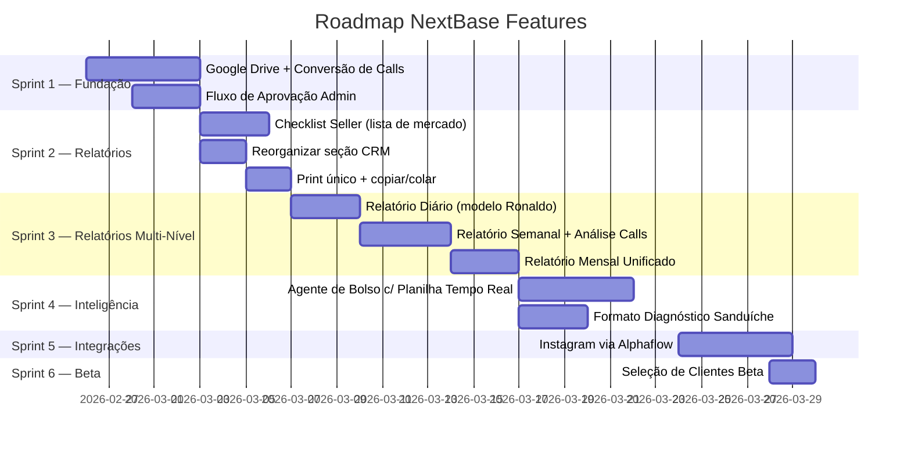

# PLAN: NextBase Features — Pós-Call de Alinhamento

> **Data da Call:** 2026-02-25 | **Projeto:** NextControl | **Supabase ID:** `mldbflihdejmddmapwnz`

## Objetivo

Implementar as features priorizadas na call com o time da NEXTBASE, transformando o NextControl em uma plataforma completa de análise de calls, relatórios multi-nível e consultoria de bolso com aprendizado contínuo.

---

## Visão Geral das Sprints



---

## Sprint 1: Pipeline de Calls (Google Drive → Análise)

### Feature 1.1 — Google Drive Upload + Conversão MP4 → MP3 → TXT

> **Já existe:** Edge function `process-upload` (uploads para Supabase Storage), `transcribe-audio` (Whisper via Groq), `analyze-call` (avalia transcrição com Gemini 2.0 Flash)

#### Tarefas

- [x] **1.1.1** Criar tabela `call_uploads` no Supabase para rastrear o pipeline:
  ```sql
  -- Campos: id, client_id, closer_id, upload_source (drive/manual), 
  -- original_url, mp3_url, transcription_text, status (uploaded/converting/transcribing/ready/analyzed),
  -- call_date, folder_path, created_at
  ```
- [x] **1.1.2** ~~Criar Edge Function `gdrive-sync`~~ → Substituído por **FFmpeg.wasm Client-Side** (extrai áudio no navegador, zero storage de vídeo) que:
  - Recebe webhook ou polling de pasta Google Drive organizada por data
  - Detecta novos arquivos MP4
  - Faz download → converte para MP3 (usando FFmpeg via Supabase Edge ou serviço externo)
  - Faz upload do MP3 para Supabase Storage
  - Dispara transcrição via `transcribe-audio` existente
  - Salva transcrição na `call_uploads`
- [x] **1.1.3** Criar página `/admin/calls-pipeline` com:
  - Lista de calls em cada estágio do pipeline (upload → conversão → transcrição → revisão → analisado)
  - Indicadores visuais de progresso por step
  - Botão para trigger manual de sync
- [x] **1.1.4** Criar componente `CallUploadCard` com status visual do pipeline

### Feature 1.2 — Fluxo de Aprovação Admin (Review antes de enviar ao cliente)

> **Já existe:** Tabela `reports` com workflow `pending → approved → delivered`, `head_agent_analysis` com status `draft → approved → rejected → sent`

#### Tarefas

- [x] **1.2.1** Criar nova seção no AdminDashboard: "Calls Pendentes de Revisão"
  - Lista de calls transcritas aguardando revisão
  - Preview da transcrição com opção de editar
  - Campo de anotações do admin
  - Botão "Reescrever com IA" (chama Gemini para reformular/melhorar a análise)
  - Botões: Aprovar / Rejeitar / Editar
- [x] **1.2.2** Ao aprovar, análise vai para o dashboard do cliente (`ClientDashboard`)
- [x] **1.2.3** Adicionar campo `admin_notes`, `approved_by`, `approved_at` na tabela `call_uploads`
- [x] **1.2.4** Prazo-alvo de ~1 hora: adicionar indicador visual de tempo desde upload

---

## Sprint 2: Ajustes na Estrutura de Relatórios

### Feature 2.1 — Formulário Checklist "Lista de Mercado"

> **Já existe:** `DailyReport.tsx` com campos numéricos individuais para cada métrica, `form_submissions` com campo JSONB `data`

#### Tarefas

- [x] **2.1.1** Redesenhar `DailyReport.tsx`:
  - Trocar inputs numéricos por checklist visual com itens 0-10 (slider/stepper) e 0-1 (toggle)
  - Estilo "lista de mercado" — items claros, checkbox/toggle rápido
  - Agrupamento visual por categoria (Prospecção, Follow-up, Conversão)
- [x] **2.1.2** Manter compatibilidade com JSONB `metrics` existente no `daily_submissions`
- [x] **2.1.3** Adicionar campo `perfil` no formulário de identificação (sellers podem atuar em múltiplos perfis)

### Feature 2.2 — Reorganizar Seção CRM

#### Tarefas

- [x] **2.2.1** Separar CRM de "identificação" e "métricas" no SellerDashboard
- [x] **2.2.2** Criar seção/tab dedicada "CRM" com navegação própria
- [x] **2.2.3** Garantir que a navegação entre seções seja fluida (tabs ou sidebar interna)

### Feature 2.3 — Print Único + Copiar/Colar Mensagens

> **Já existe:** `process-upload` permite até 5 prints, `conversation_prints TEXT[]` no `daily_submissions`

#### Tarefas

- [x] **2.3.1** Simplificar upload: aceitar apenas 1 print principal do CRM
- [x] **2.3.2** Adicionar campo de texto "Copiar/Colar Mensagens" (textarea com cola direta de conversas)
- [x] **2.3.3** Criar tab "Mensagens" ao lado de "Print" no formulário de submissão
- [x] **2.3.4** Atualizar schema `daily_submissions`: adicionar coluna `pasted_messages TEXT`

---

## Sprint 3: Sistema de Relatórios Multi-Nível

### Feature 3.1 — Relatório Diário (Modelo Ronaldo)

#### Tarefas

- [x] **3.1.1** Criar componente `DailyProgressCard`:
  - Métricas simples e diretas do seller
  - Indicadores de progresso vs. dia anterior (↑ +3 / ↓ -2)
  - Alertas quando métricas caem (badge vermelho em follow-ups, etc.)
  - Comparação visual (sparkline ou mini-bar chart)
- [x] **3.1.2** Integrar no SellerDashboard como card principal ao topo
- [x] **3.1.3** Criar query para calcular delta vs. dia anterior automaticamente

### Feature 3.2 — Relatório Semanal (Análise de Calls)

> **Já existe:** `weekly_reports` table, `CallAnalysis.tsx` page

#### Tarefas

- [x] **3.2.1** Criar tabela `weekly_analysis_reports`:
  ```sql
  -- Campos: id, client_id, week_start, week_end, 
  -- call_summaries JSONB, checklist_actions JSONB, overall_score,
  -- seller_input_id, admin_approved, client_visible, pdf_url, created_at
  ```
- [x] **3.2.2** Criar Edge Function `generate-weekly-report`:
  - Agrega calls da semana (da tabela `call_uploads`)
  - Gera análise consolidada via Gemini
  - Cria checklist de ações da semana
  - Salva como PDF disponível para download
- [x] **3.2.3** Criar página `/client/weekly-report` para download do relatório
- [x] **3.2.4** Fluxo: seller submete métricas → admin aprova → client vê

### Feature 3.3 — Relatório Mensal Unificado

#### Tarefas

- [x] **3.3.1** Criar Edge Function `generate-monthly-report`:
  - Integra dados de closer (calls), seller (métricas) e empresa (funil)
  - Formato: 3 páginas (Empresa / Closer / Seller)
  - Análise aprofundada com tendências
- [x] **3.3.2** Criar componente `MonthlyReportViewer` com 3 tabs
- [x] **3.3.3** Gerar PDF exportável com branding NextBase

---

## Sprint 4: Inteligência e Agente de Bolso

### Feature 4.1 — Agente de Bolso com Planilha em Tempo Real

> **Já existe:** `coach-chat` Edge Function, `coach_interactions` table

#### Tarefas

- [x] **4.1.1** Evoluir Edge Function `coach-chat`:
  - Antes de gerar resposta, buscar métricas recentes do seller (`daily_submissions`, `analyses`, `call_evaluations`)
  - Incluir histórico de semanas anteriores como contexto (Gemini 1M tokens)
  - Verificar quais estratégias já foram testadas e descartadas
  - Não recomendar estratégias que já falharam
- [x] **4.1.2** Criar tabela `strategy_log`:
  ```sql
  -- Campos: id, seller_id, strategy_description, tested_week, 
  -- impact_score (0-10), response_rate DECIMAL, discarded BOOLEAN, 
  -- reason TEXT, created_at
  ```
- [x] **4.1.3** Quando checklist semanal é marcado como realizado, sistema lê impacto na semana seguinte automaticamente
- [x] **4.1.4** Atualizar UI do Coach Chat para mostrar contexto de métricas no sidebar

### Feature 4.2 — Formato de Análise "Sanduíche"

> **Referência:** Diagnóstico apresentado pelo Rafael: pontos positivos → gaps → positivos. 10 páginas, baseado em 15 conversas (5 vendidas, 5 com objeção, 5 que sumiram)

#### Tarefas

- [x] **4.2.1** Criar template de prompt padronizado para análise sanduíche:
  - Seção 1: Pontos Positivos
  - Seção 2: Gaps Críticos / Estruturais
  - Seção 3: Ações Recomendadas
  - Inclui análise de conversas que converteram vs. que não converteram
- [x] **4.2.2** Atualizar Edge Function `analyze-call` com novo prompt mais detalhado
- [x] **4.2.3** Criar componente `SandwichAnalysisView` com layout visual das 3 seções
- [x] **4.2.4** Adaptar para versão concisa (3 páginas) para relatório mensal

---

## Sprint 5: Integração Instagram (Alphaflow)

### Feature 5.1 — Instagram DMs via Alphaflow

#### Tarefas

- [ ] **5.1.1** Pesquisar e obter API docs do Alphaflow hosted
- [ ] **5.1.2** Criar Edge Function `instagram-connect`:
  - Fluxo: botão "Conectar Instagram" → login username/senha → 2FA → recebe webhook
  - Armazenar tokens de forma segura no Supabase (tabela `instagram_connections`)
- [ ] **5.1.3** Criar Edge Function `instagram-webhook`:
  - Recebe webhook a cada DM nova
  - Salva no `daily_submissions` como `pasted_messages` automático
  - Custo: ~R$0,02 por request
- [ ] **5.1.4** Criar página de configuração `/seller/integrations` com botão de conectar
- [ ] **5.1.5** Calcular custo mensal estimado e exibir no admin

---

## Sprint 6: Beta Fechado

### Feature 6.1 — Seleção e Onboarding de Clientes Beta

#### Tarefas

- [x] **6.1.1** Criar flag `is_beta` na tabela `clients`
- [x] **6.1.2** Criar página `/admin/beta-management`:
  - Lista de clientes selecionados para beta
  - Toggle para ativar/desativar features por cliente
  - Tracking de feedback
- [x] **6.1.3** Criar feature flags system simples (tabela `feature_flags`)

---

## Mudanças de Database (Resumo)

| Tabela | Ação | Campos Novos |
|--------|------|-------------|
| `call_uploads` | **[NEW]** | id, client_id, closer_id, upload_source, original_url, mp3_url, transcription_text, status, admin_notes, approved_by, approved_at, call_date, folder_path |
| `daily_submissions` | **[MODIFY]** | + `pasted_messages TEXT` |
| `weekly_analysis_reports` | **[NEW]** | id, client_id, week_start, week_end, call_summaries, checklist_actions, overall_score, seller_input_id, admin_approved, client_visible, pdf_url |
| `strategy_log` | **[NEW]** | id, seller_id, strategy_description, tested_week, impact_score, response_rate, discarded, reason |
| `instagram_connections` | **[NEW]** | id, seller_id, ig_username, access_token, webhook_url, is_active, connected_at |
| `clients` | **[MODIFY]** | + `is_beta BOOLEAN DEFAULT false` |
| `feature_flags` | **[NEW]** | id, flag_key, description, is_enabled, client_ids[] |

---

## Edge Functions (Resumo)

| Função | Ação | Descrição |
|--------|------|-----------|
| `gdrive-sync` | **[NEW]** | Sincroniza Google Drive → MP3 → transcrição |
| `generate-weekly-report` | **[NEW]** | Gera relatório semanal com análise de calls |
| `generate-monthly-report` | **[NEW]** | Gera relatório mensal unificado (empresa/closer/seller) |
| `instagram-connect` | **[NEW]** | Conecta Instagram via Alphaflow |
| `instagram-webhook` | **[NEW]** | Recebe DMs do Instagram |
| `coach-chat` | **[MODIFY]** | Adicionar contexto de métricas em tempo real + strategy_log |
| `analyze-call` | **[MODIFY]** | Novo prompt formato sanduíche |

---

## Componentes Frontend (Resumo)

| Componente | Ação | Localização |
|-----------|------|-------------|
| `CallsPipelinePage` | **[NEW]** | `src/pages/admin/CallsPipeline.tsx` |
| `CallUploadCard` | **[NEW]** | `src/components/admin/CallUploadCard.tsx` |
| `DailyProgressCard` | **[NEW]** | `src/components/seller/DailyProgressCard.tsx` |
| `SandwichAnalysisView` | **[NEW]** | `src/components/analysis/SandwichAnalysisView.tsx` |
| `MonthlyReportViewer` | **[NEW]** | `src/components/reports/MonthlyReportViewer.tsx` |
| `DailyReport.tsx` | **[MODIFY]** | Redesign para checklist "lista de mercado" |
| `SellerDashboard.tsx` | **[MODIFY]** | Separar CRM + adicionar DailyProgressCard |
| `AdminDashboard.tsx` | **[MODIFY]** | Adicionar seção "Calls Pendentes" |
| `CallAnalysis.tsx` | **[MODIFY]** | Integrar SandwichAnalysisView |

---

## Prioridade de Implementação

| # | Feature | Impacto | Esforço | Prioridade |
|---|---------|---------|---------|-----------|
| 1 | Checklist Seller (lista de mercado) | 🟢 Alto | 🟡 Médio | **P0** |
| 2 | Reorganizar CRM + Print único | 🟢 Alto | 🟢 Baixo | **P0** |
| 3 | Relatório Diário (modelo Ronaldo) | 🟢 Alto | 🟡 Médio | **P0** |
| 4 | Fluxo Aprovação Admin | 🟢 Alto | 🟡 Médio | **P1** |
| 5 | Pipeline Google Drive → Transcrição | 🟡 Médio | 🔴 Alto | **P1** |
| 6 | Formato Sanduíche | 🟢 Alto | 🟡 Médio | **P1** |
| 7 | Relatório Semanal | 🟡 Médio | 🟡 Médio | **P2** |
| 8 | Agente de Bolso c/ Tempo Real | 🟢 Alto | 🔴 Alto | **P2** |
| 9 | Relatório Mensal | 🟡 Médio | 🟡 Médio | **P2** |
| 10 | Instagram Alphaflow | 🟡 Médio | 🔴 Alto | **P3** |
| 11 | Beta Management | 🟢 Alto | 🟢 Baixo | **P3** |

---

## Verificação

### Testes Automatizados
- `npm run lint` — Verificar zero erros de lint
- `npm test` — Rodar suite de testes Vitest existente
- Cada nova Edge Function: testar com `curl` local antes de deploy

### Verificação Manual
- Cada feature da sprint será testada no browser via `npm run dev`
- Fluxo completo: upload → conversão → transcrição → revisão admin → delivery cliente
- Validar responsividade mobile em todas as telas novas

### Supabase
- Rodar each migration via `mcp apply_migration` 
- Verificar RLS policies com `get_advisors(security)`
- Validar foreign keys e constraints

---

## Decisões Pendentes

> [!IMPORTANT]
> **Antes de começar a implementação, precisamos alinhar:**

1. **Google Drive — qual método de integração?**
   - Opção A: Google Drive API com OAuth (mais complexo, real-time)
   - Opção B: Folder polling via cron job (mais simples, delay de minutos)
   - Opção C: Upload manual com organização por pasta (MVP)

2. **Conversão MP4 → MP3 — onde processar?**
   - Opção A: FFmpeg no Edge Function (limitação de tempo/memória)
   - Opção B: Serviço externo (ex: cloud function com FFmpeg)
   - Opção C: Cliente faz upload já em MP3

3. **Qual Sprint começar primeiro?**
   - Sprint 2 (Ajustes UI) é mais rápida e de alto impacto
   - Sprint 1 (Pipeline) é mais complexa mas é o diferencial
   - Recomendação: **Sprint 2 primeiro** (P0), depois Sprint 3, depois Sprint 1

4. **Alphaflow — vocês já têm acesso à API?**
   - Precisamos das credenciais e docs para integrar
