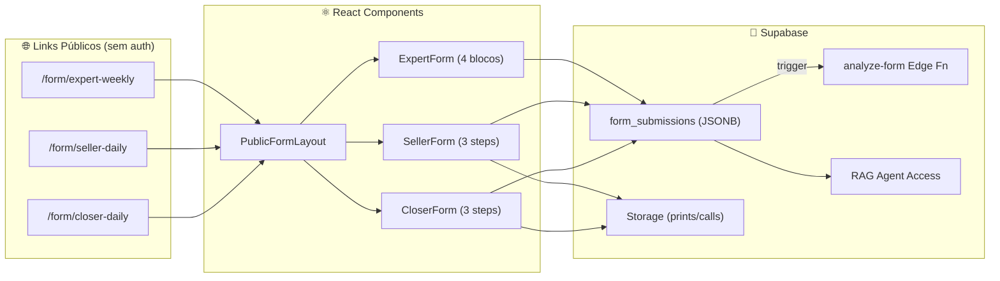
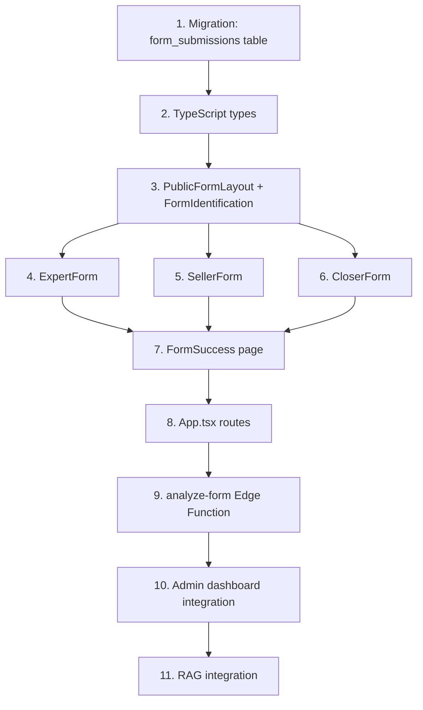

# PLAN — Public Forms System (Formulários Públicos)

> **Objetivo:** Transformar os formulários do Rafael (Expert, Social Seller, Closer) em links públicos limpos que qualquer membro da equipe pode abrir e preencher sem login, com dados caindo direto na database para análise AI e acesso pelo RAG.

---

## Decisões Confirmadas

| Decisão | Resposta |
|---------|----------|
| Tipo de link | **Slug por tipo** (`/form/seller-daily`, `/form/closer-daily`, `/form/expert-weekly`) |
| SDR separado? | **Não** — SDR = Social Seller, mesmo formulário |
| Uploads | **Supabase Storage** via `process-upload` (existente) |
| Expert — quem preenche? | **O cliente** (expert/player) preenche sobre seu próprio negócio |
| AI automática? | **Sim para todos** — cada envio dispara análise AI |
| Total de forms | **3 tipos**: Expert (2x/semana), Social Seller (diário), Closer (diário) |

---

## Arquitetura



---

## Phase 1 — Database Schema

### [NEW] Migration: `create_form_submissions`

```sql
-- Enum para tipos de formulário
CREATE TYPE public.form_type AS ENUM ('expert_weekly', 'seller_daily', 'closer_daily');

CREATE TABLE IF NOT EXISTS public.form_submissions (
    id UUID DEFAULT gen_random_uuid() PRIMARY KEY,
    form_type public.form_type NOT NULL,
    
    -- Identificação (sem auth — nome obrigatório)
    submitter_name TEXT NOT NULL,
    submitter_email TEXT,
    submitter_phone TEXT,
    
    -- Vínculo opcional com user/client existente
    user_id UUID REFERENCES auth.users(id),
    client_id UUID REFERENCES public.clients(id),
    
    -- Dados do formulário (estrutura varia por tipo)
    data JSONB NOT NULL DEFAULT '{}',
    
    -- Arquivos anexados (URLs do Storage)
    attachments TEXT[] DEFAULT '{}',
    
    -- Metadados
    submission_date DATE NOT NULL DEFAULT CURRENT_DATE,
    ip_address INET,
    user_agent TEXT,
    
    -- AI Analysis
    ai_analysis_id UUID,
    ai_score INTEGER,
    ai_status TEXT DEFAULT 'pending' CHECK (ai_status IN ('pending', 'processing', 'done', 'error')),
    
    created_at TIMESTAMPTZ DEFAULT NOW(),
    updated_at TIMESTAMPTZ DEFAULT NOW()
);

-- Indexes
CREATE INDEX idx_form_submissions_type ON public.form_submissions(form_type);
CREATE INDEX idx_form_submissions_date ON public.form_submissions(submission_date);
CREATE INDEX idx_form_submissions_name ON public.form_submissions(submitter_name);
CREATE INDEX idx_form_submissions_client ON public.form_submissions(client_id);

-- RLS: Allow anonymous inserts, restrict reads to authenticated
ALTER TABLE public.form_submissions ENABLE ROW LEVEL SECURITY;

CREATE POLICY "Anyone can submit forms" ON public.form_submissions
    FOR INSERT TO anon, authenticated WITH CHECK (true);

CREATE POLICY "Authenticated users read submissions" ON public.form_submissions
    FOR SELECT TO authenticated USING (true);

CREATE POLICY "Admin manages all" ON public.form_submissions
    FOR ALL TO authenticated USING (
        EXISTS (SELECT 1 FROM public.users WHERE id = auth.uid() AND role = 'admin')
    );
```

### JSONB `data` Schema por form_type

#### `expert_weekly`
```json
{
  "leads_range": "0-10 | 10-30 | 30-60 | 60+",
  "opportunities_opened": 5,
  "sales_closed": 2,
  "revenue": 15000.00,
  "top_channel": "inbound_organic | inbound_paid | outbound | referral | other",
  
  "lead_volume_status": "below | expected | above",
  "lead_quality": "low | medium | high",
  "bottleneck": "acquisition | qualification | conduction | closing | delivery",
  
  "content_generated_leads": true,
  "content_problems": "Falta de frequência...",
  "brand_clarity_score": 8,
  "strategic_notes": "Texto livre..."
}
```

#### `seller_daily`
```json
{
  "new_qualified_followers": 12,
  "conversations_started": 8,
  "conversations_to_opportunity": 3,
  "followups_done": 15,
  "common_objection": "Preço alto",
  "conversation_quality_score": 7,
  "crm_screenshots": ["url1.jpg", "url2.jpg"]
}
```

#### `closer_daily`
```json
{
  "calls_made": 6,
  "sales_closed": 2,
  "conversion_rate": 33.3,
  "main_objection": "Timing ruim",
  "avoidable_loss": true,
  "avoidable_loss_reason": "Não contornei objeção de preço",
  "self_score": 7,
  "call_recording_url": "storage://calls/..."
}
```

---

## Phase 2 — Frontend (Public Forms)

### Rotas (App.tsx)

```
/form/expert-weekly    → <PublicFormLayout><ExpertForm /></PublicFormLayout>
/form/seller-daily     → <PublicFormLayout><SellerForm /></PublicFormLayout>
/form/closer-daily     → <PublicFormLayout><CloserForm /></PublicFormLayout>
/form/success          → <FormSuccess />
```

> [!IMPORTANT]
> Rotas `/form/*` **não** usam `DashboardLayout` nem `RoleGuard` — são 100% públicas.

### Componentes

#### [NEW] `src/components/forms/PublicFormLayout.tsx`
- Layout limpo sem sidebar/header do dashboard
- Logo Next Control + título do formulário
- Footer com "Powered by Next Control"
- Mobile-first, dark mode, design premium

#### [NEW] `src/components/forms/FormIdentification.tsx`
- Step 0 compartilhado entre todos os forms
- Campos: Nome (obrigatório), Email, Telefone
- Auto-match com user existente via email (soft link)

#### [NEW] `src/pages/forms/ExpertForm.tsx`
- Wizard 4 blocos (conforme formulário do Rafael):
  1. **Números da Semana** — leads, oportunidades, vendas, faturamento, canal
  2. **Funil e Demanda** — volume/qualidade leads, gargalo
  3. **Posicionamento** — conteúdo, problemas, clareza marca
  4. **Resumo + Envio**

#### [NEW] `src/pages/forms/SellerForm.tsx`
- Wizard 3 steps:
  1. **Métricas** — seguidores, conversas, oportunidades, follow-ups, objeção, nota
  2. **Evidências** — upload 5 prints CRM (via process-upload)
  3. **Resumo + Envio**

#### [NEW] `src/pages/forms/CloserForm.tsx`
- Wizard 3 steps:
  1. **Métricas** — calls, vendas, conversão, objeção, venda evitável, nota
  2. **Gravação** — upload call (via process-upload)
  3. **Resumo + Envio**

#### [NEW] `src/pages/forms/FormSuccess.tsx`
- Tela de confirmação com animação
- Resumo do que foi enviado
- Timer "Próximo envio em X horas"

---

## Phase 3 — Backend (AI Pipeline)

### [NEW] Edge Function: `analyze-form-submission`

```
Input:  { submission_id: string, form_type: string }
Output: { score: number, analysis: string, improvements: string[] }
```

- Reutiliza lógica do `analyze-submission` existente
- Prompt customizado por `form_type`:
  - **expert_weekly**: Análise estratégica de funil e posicionamento
  - **seller_daily**: Análise de volume, qualidade de conversas, padrões
  - **closer_daily**: Análise de conversão, objeções, performance

### Trigger automático

Opção A — **Database webhook** (Supabase): INSERT em `form_submissions` → chama Edge Function
Opção B — **Client-side** (como funciona hoje): após insert, chama `.functions.invoke()`

> Recomendo **Opção B** (client-side) pro MVP — mais simples, funciona igual o seller atual.

### RAG Integration

Os dados de `form_submissions` ficam acessíveis pelo RAG agent via:
- Query SQL direta (match por client_id/nome)
- Ou ingestão periódica no vector store

---

## Phase 4 — Admin Dashboard Integration

### Visualização no Admin

- Nova aba "Formulários" no AdminDashboard
- Tabela com todos os envios, filtro por tipo/data/pessoa
- Link para ver detalhes + análise AI de cada envio

### CTA Links no Admin

- Botão "Copiar Link" para cada tipo de formulário
- QR code gerado para facilitar compartilhamento mobile

---

## Dependency Graph



---

## Estimativa

| Phase | Tarefas | Complexidade |
|-------|---------|-------------|
| **Phase 1** — Schema | Migration + Types | Baixa |
| **Phase 2** — Frontend | 6 componentes novos + rotas | Alta |
| **Phase 3** — AI Pipeline | 1 Edge Function + trigger | Média |
| **Phase 4** — Admin | Listagem + links | Média |

**Total estimado:** ~12 arquivos novos, ~4 arquivos modificados

---

## Files Affected

### New Files (12)
| File | Agent |
|------|-------|
| `src/lib/migration_public_forms.sql` | `@backend-specialist` |
| `src/types/forms.ts` | `@backend-specialist` |
| `src/components/forms/PublicFormLayout.tsx` | `@frontend-specialist` |
| `src/components/forms/FormIdentification.tsx` | `@frontend-specialist` |
| `src/components/forms/FormWizard.tsx` | `@frontend-specialist` |
| `src/pages/forms/ExpertForm.tsx` | `@frontend-specialist` |
| `src/pages/forms/SellerForm.tsx` | `@frontend-specialist` |
| `src/pages/forms/CloserForm.tsx` | `@frontend-specialist` |
| `src/pages/forms/FormSuccess.tsx` | `@frontend-specialist` |
| `src/lib/formSubmission.ts` | `@backend-specialist` |
| `supabase/functions/analyze-form/index.ts` | `@backend-specialist` |
| `src/components/admin/FormSubmissionsList.tsx` | `@frontend-specialist` |

### Modified Files (4)
| File | Change |
|------|--------|
| `src/App.tsx` | Add `/form/*` public routes |
| `src/types/index.ts` | Re-export form types |
| `src/pages/admin/AdminDashboard.tsx` | Add "Formulários" tab |
| `src/lib/supabase.ts` | Helper for anon form submissions |

---

## Phase X — Verification

- [ ] All 3 form types render at public URLs without login
- [ ] Form submission inserts into `form_submissions` table
- [ ] File uploads work via `process-upload`
- [ ] AI analysis triggers on submit
- [ ] Admin can view all submissions
- [ ] Mobile viewport (375px) renders correctly
- [ ] TypeScript builds clean (`tsc --noEmit`)
- [ ] Forms readable by RAG agent queries
